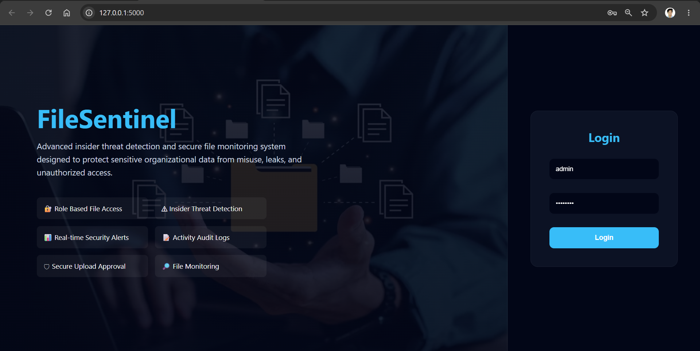
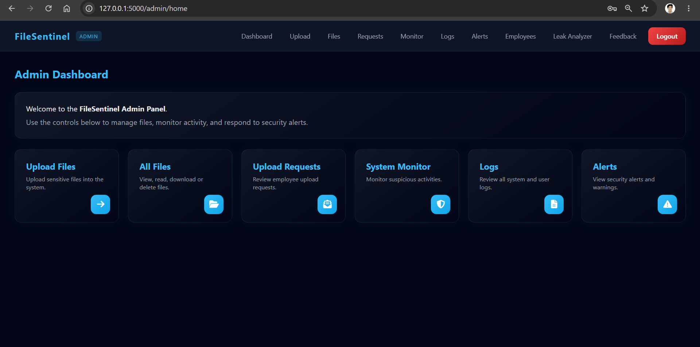
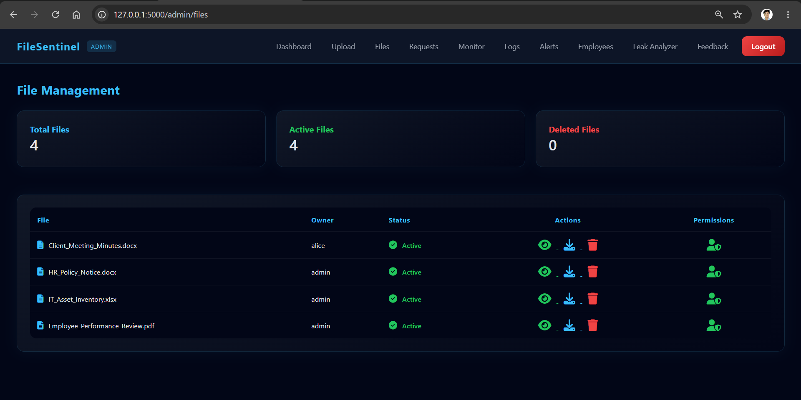
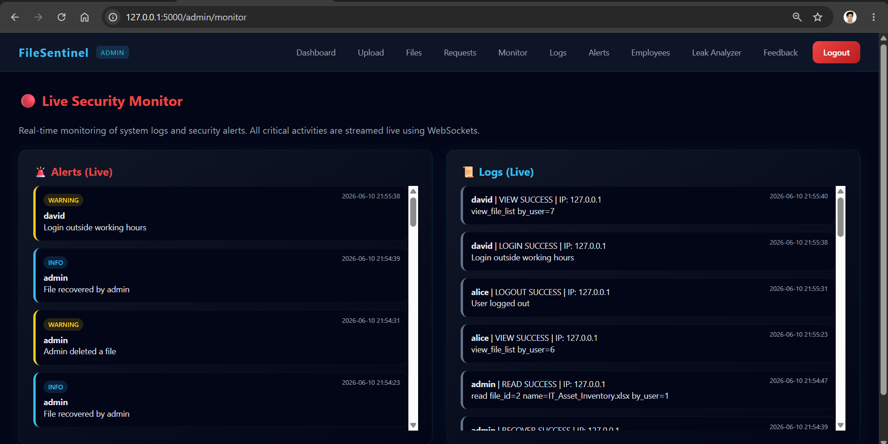
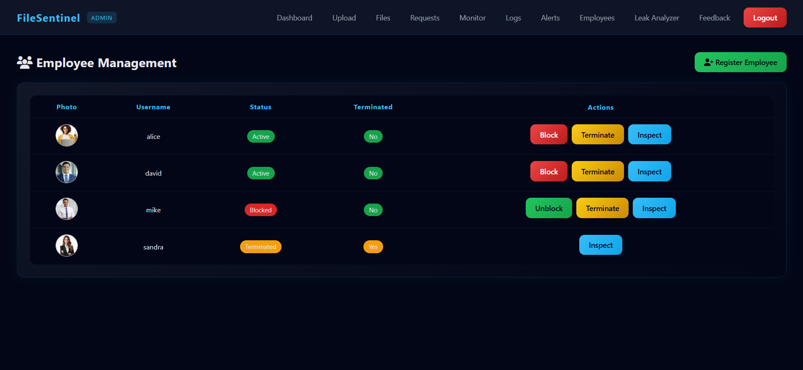
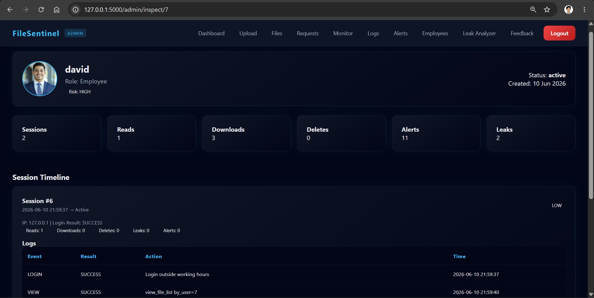
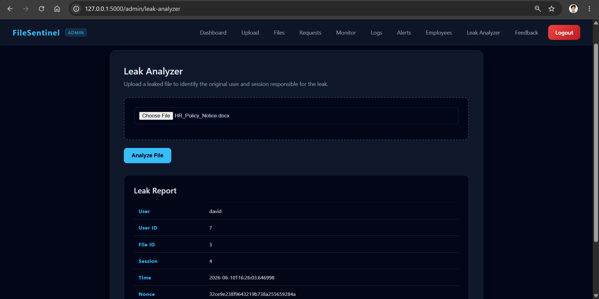
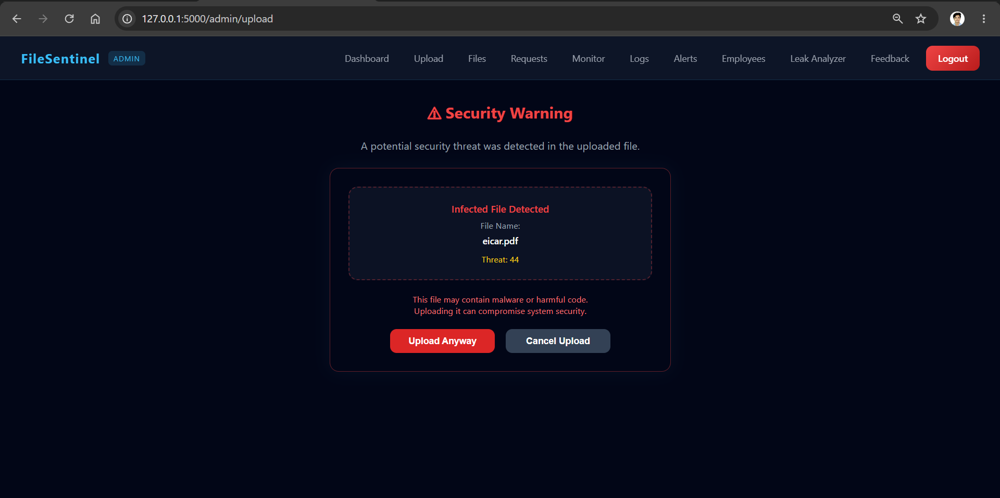
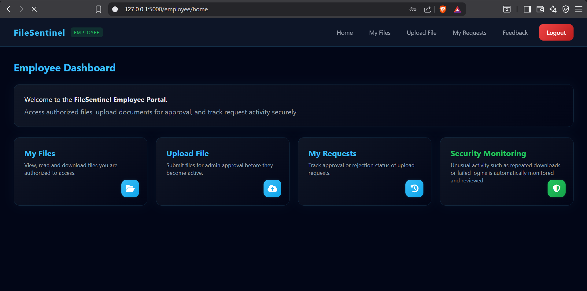
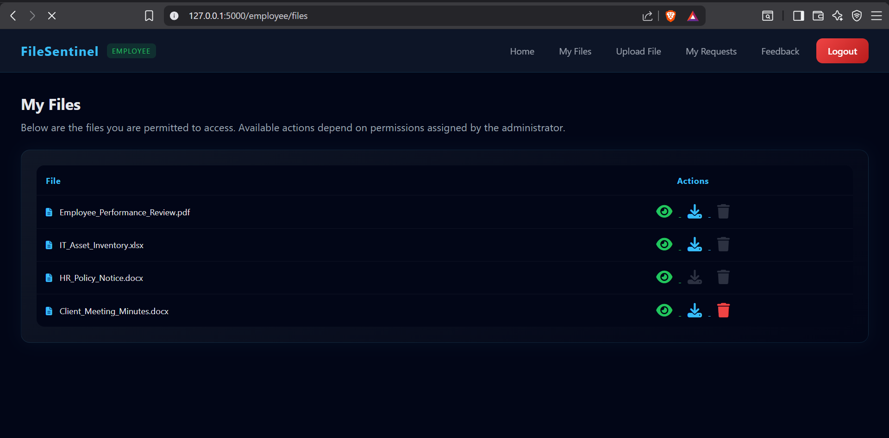

# FileSentinel

Advanced Insider Threat Detection and Secure File Monitoring System developed using Flask.

---

# Overview

FileSentinel is a cybersecurity-focused secure file management and monitoring system designed to detect insider threats, monitor suspicious activities, analyze leaked files, and securely manage organizational documents.

The project includes:

* Role-based authentication
* Secure file uploads
* Malware detection using ClamAV
* File watermarking
* Leak analysis and tracing
* Real-time monitoring dashboard
* Employee activity inspection
* Security alerts and audit logging

---

# Features

## Authentication

* Admin and Employee login system
* Secure password hashing using bcrypt
* Session management

## File Management

* Upload and manage files securely
* Support for:

  * PDF
  * DOCX
  * XLSX
* File permissions management
* Download tracking
* File deletion tracking

## Security Features

* Malware scanning using ClamAV
* Real-time suspicious activity monitoring
* Security alerts dashboard
* Insider threat detection
* File watermarking and leak tracing

## Monitoring & Analytics

* Live security monitor
* Real-time logs using WebSockets
* Employee inspection dashboard
* Leak analyzer system
* Session timeline tracking

---

# Technologies Used

## Backend

* Python
* Flask
* Flask-SocketIO
* SQLAlchemy

## Frontend

* HTML
* CSS
* JavaScript

## Database

* MySQL
* WAMP Server
* SQLyog

## Security Tools

* ClamAV Antivirus
* Watermark Tracking
* Audit Logging

---

# Requirements

Install the following software before running the project:

* Python 3.11+
* WAMP Server
* SQLyog or phpMyAdmin
* ClamAV
* Git

---

# Project Structure

```text
filesentinel/
│
├── app.py
├── config.py
├── extensions.py
├── filesentinel.sql
├── requirements.txt
├── README.md
│
├── modules/
│   ├── admin.py
│   ├── auth.py
│   ├── employee.py
│   ├── virus_scan.py
│   ├── watermark.py
│   ├── leak_analyzer.py
│   └── ...
│
├── templates/
├── static/
│   ├── css/
│   ├── js/
│   └── images/
│
├── screenshots/
├── storage/
│   ├── backups/
│   ├── files/
│   ├── pending/
│   ├── profile/
│   └── temp/
│
└── uploads/
```

---

# Installation & Setup Guide

---

# Step 1 — Clone Repository

```bash
git clone https://github.com/YOUR_USERNAME/filesentinel.git
cd filesentinel
```

---

# Step 2 — Create Virtual Environment

```bash
python -m venv venv
```

Activate virtual environment:

## Windows

```bash
venv\Scripts\activate
```

---

# Step 3 — Install Dependencies

```bash
pip install -r requirements.txt
```

---

# Step 4 — Start WAMP Server

Open WAMP Server and ensure:

* Apache is running
* MySQL is running

---

# Step 5 — Create Database

Open SQLyog or phpMyAdmin.

Create database:

```text
filesentinel
```

---

# Step 6 — Import SQL File

Import the provided SQL file:

```text
filesentinel.sql
```

---

# Step 7 — Default Admin Credentials

The admin account is already included inside the SQL file.

```text
Username: admin
Password: admin123
```

---

# Step 8 — Configure Database

Open:

```text
config.py
```

Update MySQL username and password if required.

Example:

```python
MYSQL_HOST = "localhost"
MYSQL_USER = "root"
MYSQL_PASSWORD = ""
MYSQL_DB = "filesentinel"
```

---

# Step 9 — Install ClamAV

Install ClamAV Antivirus.

Ensure these services/files are available:

```text
clamd.exe
freshclam.exe
```

Update virus database:

```bash
freshclam
```

---

# Step 10 — Configure ClamAV Path

Open:

```text
modules/virus_scan.py
```

Update ClamAV executable path if needed.

Example:

```python
CLAMSCAN_PATH = r"C:\Program Files\ClamAV\clamscan.exe"
```

---

# Step 11 — Run Project

```bash
python app.py
```

Open browser:

```text
http://127.0.0.1:5000
```

---

# Screenshots

## Login Page



## Admin Dashboard



## File Management



## Live Security Monitor



## Employee Management



## Employee Inspect Dashboard



## Leak Analyzer



## Malware Detection



## Employee Dashboard



## Employee Files



---

# Important Notes

* Empty folders are maintained using `.gitkeep`
* ClamAV must be properly configured for malware detection
* Ensure MySQL credentials are correct
* Storage folders are used for runtime file handling
* WebSocket monitoring requires Flask-SocketIO

---

# Future Improvements

* AI-based anomaly detection
* Email alert system
* Multi-factor authentication
* Cloud deployment support
* Advanced analytics dashboard

---

# Disclaimer

This project was developed for educational and cybersecurity learning purposes only.
